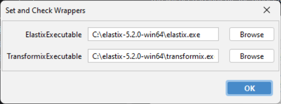

# Installation

ABBA consists of a Fiji plugin, an extension for QuPath, and it can communicate with external components to automate the registration process.

:::{hint}
The QuPath extension, and in general, the use of QuPath is optional in ABBA but strongly encouraged. It will be helpful to define the dataset and it'll particularly useful for post-registration analysis.
:::

# Fiji + ABBA plugin installation

:::{tip}
If you are using Windows, [a standalone installer is available](https://github.com/BIOP/ijp-imagetoatlas/releases/).
:::

ABBA is a Fiji plugin that can be installed easily, however, a bare ABBA will lack key features. In particular ABBA is supposed to interact with these components:

* [DeepSlice](https://www.deepslice.com.au/): a deep-learning registration method that automatically register coronal sections to mouse and rat brain atlases
* [elastix/transformix](https://github.com/SuperElastix/elastix): the software that automates 2D in-plane registration
* [BrainGlobe](https://brainglobe.info/documentation/bg-atlasapi/index.html): a python library that standardized a set of atlases, and the way to access their data

There are 3 main ways to install ABBA, that correspond to different parts of the documentation:
* Using an installer (available for Windows only)
* Using [Fiji](https://fiji.sc/)
* Using python with a pip dependency [abba_python](https://pypi.org/project/abba-python/)

Here's a summary of the supported functionality depending on how ABBA is installed and on the OS:

|                                                                          | Headless | GUI | Mouse and Rat atlases | Brainglobe Atlases | DeepSlice (Local) |
|--------------------------------------------------------------------------|----------|-----|-----------------------|--------------------|-------------------|
| Opt 1. ABBA installer (Win only)                                         | [x]      | [x] | [x]                   | [x]                | [x]               |
| Opt 2. Fiji + PTBIOP update site (Win, Mac, Linux)                       | [x]      | [x] | [x]                   |                    |                   |
| Opt 2. Fiji + PTBIOP update site + DeepSlice conda env (Win, Mac, Linux) | [x]      | [x] | [x]                   |                    | [x]               |
| Opt 3. abba_python (Win, Linux)                                          | [x]      | [x] | [x]                   | [x]                |                   |
| Opt 3. abba_python + DeepSlice conda env (Win, Linux)                    | [x]      | [x] | [x]                   | [x]                | [x]               |
| Opt 3. abba_python (Mac)                                                 | [x]      |     | [x]                   | [x]                |                   |
| Opt 3. abba_python + DeepSlice conda env (Mac)                           | [x]      |     | [x]                   | [x]                | [x]               |

## Option 1 - Installing ABBA plugin with an installer (Windows only)

This possibility is the easiest one. It is available only if you are working with windows:

[https://github.com/BIOP/ijp-imagetoatlas/releases/latest](https://github.com/BIOP/ijp-imagetoatlas/releases/latest)

Be aware that you need an internet connection if you run the installer because at some point in the process some dependencies have to be downloaded from PyPI ([deepslice](https://pypi.org/project/DeepSlice/), [abba-python](https://pypi.org/project/abba-python/), [brainglobe-api](https://pypi.org/project/brainglobe-atlasapi/)). Also, the first time you run ABBA, you will have to download the atlas you'd like to use from internet.

## Option 2 - Installing ABBA plugin in Fiji

### 1. Download and install Fiji
If you do not have Fiji already, download it and install it from [fiji.sc](https://fiji.sc/).

### 2. Activate the PTBIOP update site
* Click `Help > Update... > Manage update sites`
* Tick the checkbox `PTBIOP`
* Click `Apply and close`
* Click `Apply changes`
* Close and restart Fiji

### 3. If you use OMERO, activate the OMERO 5.5-5.6 update site
* Click `Help > Update... > Manage update sites`
* Tick the checkbox `OMERO 5.5-5.6`
* Click `Apply and close`
* Click `Apply changes`
* Close and restart Fiji

### 4. Install elastix/transformix

For automated 2D in-plane registration, ABBA uses the [elastix](https://github.com/SuperElastix/elastix) software, which is independent of Fiji. To use it, elastix should be installed, and its executable location (elastix and transformix) should be specified in Fiji.

* Download the [release 5.2.0 of elastix for your OS](https://github.com/SuperElastix/elastix/releases/tag/5.2.0).

* Unzip it somewhere convenient ( `C` drive on windows; `Applications` for Mac )

#### Windows

For windows users, you also need to install [Visual C++ redistributable](https://learn.microsoft.com/en-us/cpp/windows/latest-supported-vc-redist?view=msvc-170), (choose `vc_redist.x64.exe` for a 64-bit system).

#### Mac

Fiji will be calling the elastix executables, which are recognized as ‘unknown developers’ by Mac OS. Thus you need to [make security exceptions for both elastix and transformix](https://support.apple.com/en-hk/guide/mac-help/mh40616/mac) to avoid clicking indefinitely on the OS warning messages.

#### Linux
Nothing particular should be required for linux system.

#### Indicate `elastix` and `transformix` executable location in Fiji:

For all OSes, once elastix is installed, please run Fiji, then execute `Plugins › BIOP › Set and Check Wrappers`. You will need to indicate the proper location of executable files, for instance:

This message should show up in the ImageJ console (and maybe errors for other wrappers, but that's not important):
* `[INFO] Transformix	->	set :-)`
* `Elastix	->	set :-)`

Once elastix is installed, you can run [the following script](https://gist.github.com/NicoKiaru/b91f9f3f0069b765a49b5d4629a8b1c7) in Fiji to test elastix functionality. Save the linked file with a `.groovy` extension, open it in Fiji, and run it.

### 5. Installing DeepSlice locally (optional)

It is possible to use the web interface of DeepSlice, without any further installation. However, it is convenient to have it installed locally since it will require less user manipulation and enable the registration procedure to be fully automated.

To install DeepSlice locally, please follow the instructions specified in the [BIOP wrappers repository](https://github.com/BIOP/ijl-utilities-wrappers#deepslice). In brief, the installation consists of:
* installing miniforge
* creating a conda environment for deepslice
* adding conda to the PATH environment variable (windows)
* specifying the conda environment location in Fiji

## Option 3 - Installing ABBA plugin in python

ABBA is available as a [PyPI dependency](https://pypi.org/project/abba-python/). If you want to use this dependency, please check the installation instruction and startup command in the [readme of abba_python](https://pypi.org/project/abba-python/).

# QuPath + ABBA extension installation

1. Install [QuPath](https://qupath.github.io/)
2. Download [QuPath's ABBA extension zip file](https://github.com/BIOP/qupath-extension-abba/releases/latest) (named `qupath-extension-abba-x.y.z.zip`)
3. Unzip it
4. Drag and drop the jar files it contains into QuPath's main graphical user interface

:::{note}
If you want to work on data from an OMERO database, install the [QuPath OMERO RAW extension](https://github.com/BIOP/qupath-extension-biop-omero). Please check its [readme](https://github.com/BIOP/qupath-extension-biop-omero/blob/omero-raw/README.md) for installation instructions.
:::

5. Restart QuPath. In `Extensions>Manage extensions` you should see the following extensions installed:
* ABBA
* Image Combiner Warpy
* Warpy
* OMERO BIOP

